# 3D-face-model: Realization of aesthetic effects on 3D face models

## Introduction

This project is for CMPUT 414 class project in University of Alberta.

It's extended based on Yadira F's code, you can find it at https://github.com/YadiraF/face3d.

My purpose was to resize part of the input face image to achieve aesthetic effects. I focused mainly on the 3D-face-model/examples/2_3dmm.py/ and 3D-face-model/face3d/mesh/transform.py/.

Two new functions, partial_reshape and fit, are introduced in transform.py which translates the points in the mesh and hence resize the facial part. Details can be found in citations in the code.

Also, a file data.txt is provided and you can type in the parameters taken by the partial reshape function there for convinient use.

The format should strictly follow
```text
x_:      float, in range[0,1], indicating the start position of the region on x_axis
x_end:   float, in range[0,1], indicating the end position of the region on x_axis, x_end > x_
y_:      float, in range[0,1], indicating the start position of the region on y_axis
y_end:   float, in range[0,1], indicating the end position of the region on y_axis, y_end > y_
z_:      float, in range[0,1], indicating the start position of the region on z_axis
z_end:   float, in range[0,1], indicating the end position of the region on z_axis, z_end > z_
x_scale: float, positive, indicating the scaling factor on x_axis
y_scale: float, positive, indicating the scaling factor on y_axis
z_scale: float, positive, indicating the scaling factor on z_axis
```
Each line should only containly one int or float.

The following is from Yadira F's building process, no extra building is necessary for our project.
# How to build

## Structure

```python
# Since triangle mesh is the most popular representation of 3D face, 
# the main part is mesh processing.
mesh/             # written in python and c++
|  cython/               # c++ files, use cython to compile 
|  io.py                 # read & write obj
|  vis.py                # plot mesh
|  transform.py          # transform mesh & estimate matrix
|  light.py              # add light & estimate light(to do)
|  render.py             # obj to image using rasterization render

mesh_numpy/      # the same with mesh/, with each part written in numpy
                 # slow but easy to learn and modify

# 3DMM is one of the most popular methods to generate & reconstruct 3D face.
morphable_model/
|  morphable_model.py    # morphable model class: generate & fit
|  fit.py                # estimate shape&expression parameters. 3dmm fitting.
|  load.py               # load 3dmm data
```


## Examples:

`cd ./examples`

* **3dmm**.  `python 2_3dmm.py`

  left:     random example generated by 3dmm

  right:  fitting face with 3dmm using 68 key points

  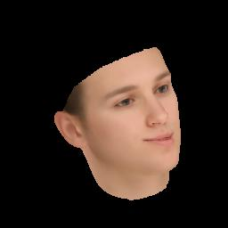 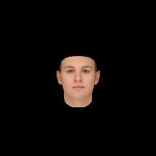

* **transform.**  `python 3_transform.py`  
  left:  

  fix camera position & use orthographic projection.  (often used in reconstruction)

  then transform face object: scale, change pitch angle, change yaw angle, change roll angle

  right: 

  fix obj position & use perspective projection(fovy=30).  (simulating real views)

  then move camera position and rotate camera: from far to near,  down & up, left & right, rotate camera

  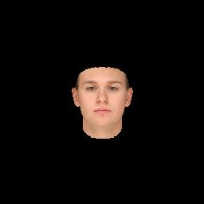 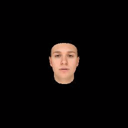

* **light**.   `python 4_light.py`  

  single point light: from left to right, from up to down, from near to far

  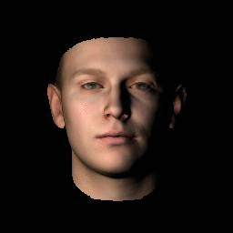

* **image map** `python 6_image_map.py`  

  render different attributes in image pixels.

  : depth, pncc, uv coordinates

  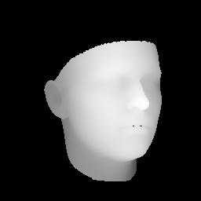 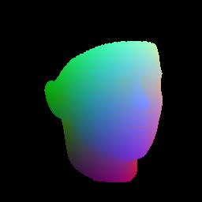 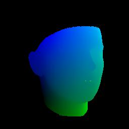

* **uv map** `python 7_uv_map.py`

  render different attributes in uv coordinates.

  : colors(texture map), position(2d facial image & corresponding position map)

  

  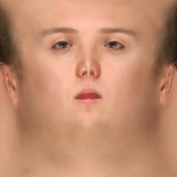 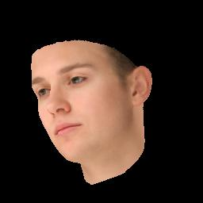 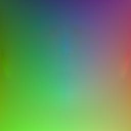 


## Getting Started

### Prerequisite

- Python 2 or Python 3 

- Python packages:
  * numpy 
  * skimage (for reading&writing image)
  * scipy (for loading mat)
  * matplotlib (for show)
  * Cython (for compiling c++ file)


### Usage

1. Clone the repository

    ```bash
    git clone https://github.com/YadiraF/face3d
    cd face3d
    ```

2. Compile c++ files to .so for python use (ignore if you use numpy version)

    ```bash
    cd face3d/mesh/cython
    python setup.py build_ext -i 
    ```

3. Prepare **BFM** Data (ignore if you don't use 3dmm)

   see [Data/BFM/readme.md](https://github.com/YadiraF/face3d/blob/master/examples/Data/BFM/readme.md)

4. Run examples

    (examples use cython version, you can change `mesh` into `mesh_numpy` to use numpy version)

    ```bash
    cd examples
    python 1_pipeline.py 
    ```

    For beginners who want to continue researches on 3D faces, I strongly recommend you first run examples according to the order, then view the codes in mesh_numpy and read the comments written in the beginning in each file. Hope this helps!  

    Moreover, I am new in computer graphics, so it would be great appreciated if you could point out some of my wrong expressions. Thanks!


